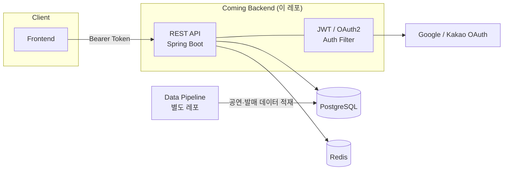
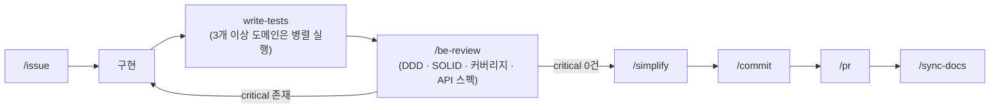
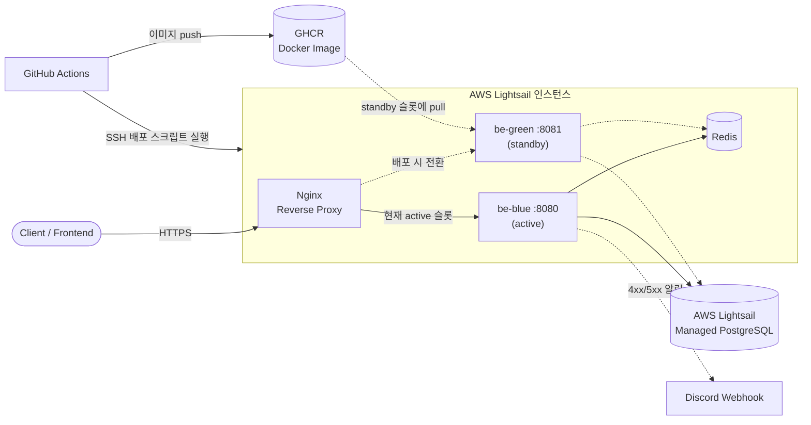

# Coming Backend

[](LICENSE)
[](https://github.com/Cominggg/Backend/actions/workflows/ci.yml)
[](build.gradle)
[](build.gradle)

**Jpop 아티스트**의 팔로우, 공연 일정, 음악 발매 정보를 제공하는 **Coming** 서비스의 백엔드 서버입니다.
Spring Boot 4 기반으로 REST API를 제공하며, 개발 전 과정을 Claude Code 서브에이전트·스킬 워크플로우와 함께 진행한 1인 프로젝트입니다.

> Frontend / Data Pipeline / API 명세는 별도 레포(`Frontend`, `Data`, `Specification`)로 분리되어 있고, 이 레포는 그중 BE(백엔드)를 담당합니다.

## 목차

- [기술 스택](#기술-스택)
- [시스템 구성](#시스템-구성)
- [핵심 도메인](#핵심-도메인)
- [AI 협업 워크플로우](#ai-협업-워크플로우)
- [로컬 실행](#로컬-실행)
- [테스트](#테스트)
- [모니터링 · 부하 테스트](#모니터링--부하-테스트)
- [CI/CD · 배포 아키텍처](#cicd--배포-아키텍처)
- [프로젝트 규모](#프로젝트-규모)
- [License](#license)
- [Contact](#contact)

---

## 기술 스택

| 분류 | 내용 |
|------|------|
| Language | Java 21 |
| Framework | Spring Boot 4.0.6 |
| DB | PostgreSQL + Flyway |
| Cache / Rate Limit | Redis, Bucket4j |
| Auth | OAuth2 (Google / Kakao) + JWT |
| ORM | Spring Data JPA |
| API 문서 | springdoc-openapi |
| 모니터링 | Actuator + Micrometer(Prometheus) + Grafana |
| 부하 테스트 | k6 |
| CI/CD | GitHub Actions → GHCR → SSH 배포 |
| 컨테이너 | Docker |

## 시스템 구성



- **Data Pipeline**이 KOPIS 등 외부 API에서 공연·아티스트·발매 데이터를 수집해 동일 DB에 적재하고, 이 레포는 그 데이터를 API로 서빙합니다.
- 명세는 `Specification` 레포에서 단일 소스로 관리하며, BE·FE·Data가 이를 기준으로 동기화됩니다.

## 핵심 도메인

| 도메인 | 주요 기능 |
|--------|-----------|
| `auth` | OAuth2 로그인(Google/Kakao), JWT 발급·재발급, Redis 블랙리스트 로그아웃 |
| `artist` | 아티스트 조회, 팔로우 |
| `concert` | 공연 조회, 예매 링크, 셋리스트, 인기순 정렬 |
| `calendar` | 사용자 공연 캘린더 등록/조회 |
| `release` | 아티스트별 음악 발매(앨범/싱글/EP) 정보 |
| `user` | 사용자 정보 |
| `inquiry` | 문의 등록·조회, 이벤트 기반 알림 |
| `admin` | 관리자 전용 CRUD (아티스트·공연 등) |

**인증 정책**: Access Token 30분(`Authorization: Bearer`), Refresh Token 7일(HttpOnly Cookie), 로그아웃 시 Redis 블랙리스트 등록.

**공통 응답 형식**
```json
// 에러
{ "code": "CONCERT_NOT_FOUND", "message": "존재하지 않는 공연입니다." }

// 페이지네이션
{ "content": [], "page": 0, "size": 20, "totalElements": 100, "totalPages": 5 }
```

---

## AI 협업 워크플로우

이 프로젝트는 기능 구현뿐 아니라 **개발 프로세스 자체를 Claude Code의 서브에이전트·스킬로 설계**했습니다.
1인 개발이지만, 역할을 나눠 병렬로 검토·검증하는 체계를 갖추는 것을 목표로 했습니다.

### 개발 흐름



- `/be-review`에서 🔴 critical 이슈가 0건일 때만 커밋으로 진행합니다.
- auth 관련 코드(JWT, OAuth2, Redis 토큰 처리)는 `/security-review`를 추가로 실행합니다.
- 테스트 작성은 도메인 수에 따라 병렬/순차를 구분합니다 — 3개 이상 도메인은 에이전트를 병렬 호출하고, 1~2개는 순차 작성합니다(cold start 중복 비용이 병렬화 이득을 초과하는 지점을 기준으로 판단).

### 도메인 전문가 서브에이전트

기능 추가 전 검토가 필요할 때, 실제 API·DB 스키마를 알고 있는 역할별 에이전트에게 병렬로 의견을 구합니다.

| 에이전트 | 역할 |
|----------|------|
| `pm-expert` | 사용자 가치·우선순위·운영 리스크 관점 검토 |
| `be-expert` | API 설계, DB 스키마 변경, 인증·보안 영향 검토 |
| `fe-expert` | 기존 컴포넌트·UX 관점에서 구현 난이도 검토 |
| `data-expert` | 외부 수집 파이프라인 영향, 수집 주기·매칭 로직 검토 |

`review-feature` 스킬은 이 4개 에이전트를 **동시에** 호출한 뒤, 아래 규칙으로 결과를 합산해 최종 권고를 냅니다.

- 전원 "추가" → ✅ 추가
- 1개 이상 "조건부" + 나머지 "추가" → ⚠️ 조건부 추가
- 2개 이상 "보류" → 🔁 보류
- 1개 이상 "반려" → ❌ 반려

### 커스텀 스킬

| 스킬 | 역할 |
|------|------|
| `be-review` | DDD 레이어·SOLID·테스트 커버리지·API 스펙 리뷰, 심각도별(🔴/🟡/🔵) 보고 |
| `security-review` | auth 관련 코드 보안 검토 |
| `review-feature` | 신규 기능 아이디어를 4개 에이전트로 병렬 사전 검토 |
| `commit` / `pr` | 컨벤션에 맞는 커밋 메시지·PR 초안 자동 생성 |

이 외에 이슈 생성·브랜치 자동화(`issue`), 명세 동기화(`read-spec`/`sync-docs`) 등 반복 작업용 스킬도 함께 운용하고 있습니다.

### 안전장치

- `application-local.yaml`, `.env`, `credentials`가 포함된 파일명은 프로젝트 훅(`.claude/settings.json`)이 Claude의 Write/Edit 자체를 차단합니다.
- `write-tests` 에이전트를 프로젝트 로컬로 두어(`.claude/agents/write-tests.md`) 이 레포의 테스트 컨벤션에 맞는 테스트만 생성하도록 제한했습니다.

이 워크플로우를 설계하며 겪은 구체적인 판단·트레이드오프는 별도 문서로 기록하고 있습니다.

---

## 로컬 실행

전제 조건: PostgreSQL(Homebrew), Redis(Docker)가 구동 중이어야 합니다.

```bash
brew services start postgresql@18
open -a Docker && docker start redis   # Docker 데몬이 꺼져 있으면 먼저 기동

./gradlew bootRun   # 로컬 실행
```

> `application-local.yaml`은 gitignore 대상입니다. 필요한 값은 별도로 안내받아 로컬에 직접 추가해야 합니다.

## 테스트

```bash
./gradlew test
./gradlew test --tests "com.Coming.Backend.artist.service.ArtistServiceTest"   # 단일 클래스
```

## 모니터링 · 부하 테스트

- `docker-compose.monitoring.yml` — Prometheus + Grafana 로컬 모니터링
- `load-test/k6/` — k6 부하 테스트 스크립트 (공연 목록 조회 등)
- Rate Limit은 Bucket4j 기반으로, 버킷 용량·refill 값을 설정으로 분리해 운영 중 조정 가능

## CI/CD · 배포 아키텍처



- **CI** (`ci.yml`): PR 생성 시 PostgreSQL·Redis 컨테이너를 띄워 전체 테스트 실행 + Docker 이미지 빌드 검증
- **CD** (`cd.yml`): `main` 브랜치 push 시 Docker 이미지를 GHCR에 push하고, Lightsail 인스턴스로 SSH 접속해 `scripts/deploy.sh` 실행
- Nginx가 `be-blue`(:8080)/`be-green`(:8081) 중 활성 슬롯으로만 트래픽을 전달하고, Redis는 같은 Docker Compose 내에서 두 슬롯이 공유합니다.
- 배포 시 standby 슬롯에 새 이미지를 pull → `/actuator/health` 체크 통과 → Nginx upstream 전환 → 이전 슬롯 정지 순으로 무중단 배포합니다.
- DB는 별도 Lightsail 인스턴스(Managed PostgreSQL)로 분리되어 두 슬롯이 공통으로 바라보고, 4xx/5xx 에러는 Discord Webhook으로 실시간 알림됩니다.

## 프로젝트 규모

| 항목 | 내용 |
|------|------|
| 개발 기간 | 2026-05 ~ (진행 중) |
| 도메인 수 | 8개 (auth / artist / concert / calendar / release / user / inquiry / admin) |
| DB 마이그레이션 | 25개 (Flyway) |
| 연동 레포 | 4개 (Backend / Frontend / Data / Specification) |

---

## License

이 프로젝트는 [MIT License](LICENSE)를 따릅니다.

## Contact

| 채널 | 링크 |
|------|------|
| GitHub | [You-Hyuk](https://github.com/You-Hyuk) |
| Email | dbgur3315@gmail.com |
| Blog | [velog.io/@youhyuk_](https://velog.io/@youhyuk_/posts) |
