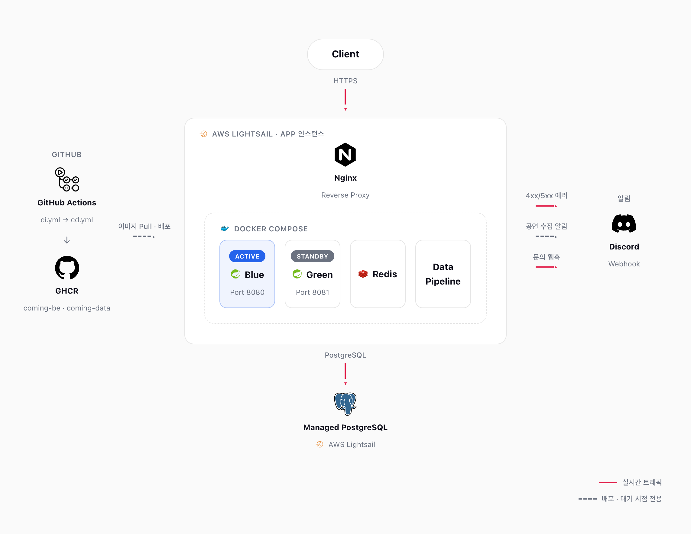

<div align="center">
  

  <br />
  <br />

  **Jpop 아티스트 내한 공연 정보 통합 플랫폼**

  아티스트·공연·발매 데이터를 서빙하는 REST API 서버 — Claude Code 서브에이전트·스킬 워크플로우로 개발 전 과정을 진행한 1인 프로젝트입니다.

  <br />

  [](build.gradle)
  [](build.gradle)
  [](build.gradle)
  [](https://www.postgresql.org/)
  [](https://redis.io/)
  [](Dockerfile)
  [](https://github.com/Cominggg/Backend/actions/workflows/ci.yml)
  [](LICENSE)

  <br />

  **[→ comingg.com](https://comingg.com)**

</div>

---

## 기술 스택

| 분류 | 내용 |
|------|------|
| Language | Java 21 |
| Framework | Spring Boot 4.0.6 |
| DB | PostgreSQL + Flyway |
| Cache / Rate Limit | Redis, Bucket4j |
| Auth | OAuth2 (Google / Kakao) + JWT |
| ORM | Spring Data JPA |
| API 문서 | springdoc-openapi |
| 모니터링 | Actuator + Micrometer(Prometheus) + Grafana |
| 배치 · 메일 | Spring Batch, Spring Mail + Thymeleaf |
| 부하 테스트 | k6 |
| CI/CD | GitHub Actions → GHCR → SSH 배포 |
| 컨테이너 | Docker |

## 핵심 도메인

| 도메인 | 주요 기능 |
|--------|-----------|
| `auth` | OAuth2 로그인(Google/Kakao), JWT 발급·재발급, Redis 블랙리스트 로그아웃 |
| `artist` | 아티스트 조회, 팔로우 |
| `concert` | 공연 조회, 예매 링크, 셋리스트, 인기순 정렬, 별점 등록 |
| `calendar` | 사용자 공연 캘린더 등록/조회 |
| `release` | 아티스트별 음악 발매(앨범/싱글/EP) 정보, 별점 등록 |
| `rating` | 공연·발매 별점 저장 및 평균 집계 |
| `post` | 커뮤니티 게시글·댓글, 추천·좋아요, 아티스트/공연/발매 멘션 태그, 통합 검색 |
| `report` | 게시글·댓글 신고, 이벤트 기반 알림 |
| `notice` | 공지사항 조회 |
| `policy` | 약관·개인정보처리방침 버전 관리, 개정 시 Spring Batch 기반 안내 메일 발송 |
| `user` | 마이페이지 (다가오는 공연, 관람 이력, 내 문의) |
| `inquiry` | 문의 등록·조회, 이벤트 기반 알림 |
| `admin` | 관리자 전용 기능 (아티스트·공연·공지·문의·신고 관리, 데이터 파이프라인 수집 요청) |

**인증 정책**: Access Token 30분(`Authorization: Bearer`), Refresh Token 7일(HttpOnly Cookie), 로그아웃 시 Redis 블랙리스트 등록.

**공통 응답 형식**

에러
```json
{ "code": "CONCERT_NOT_FOUND", "message": "존재하지 않는 공연입니다." }
```

페이지네이션
```json
{ "content": [], "page": 0, "size": 20, "totalElements": 100, "totalPages": 5 }
```

---

## AI 협업 워크플로우

Claude Code 에이전트·스킬·훅으로 이슈부터 PR까지 진행합니다. 프로젝트 규칙은 [`CLAUDE.md`](CLAUDE.md)에 모여 있고, 아래 도구들이 그 규칙을 역할별로 나눠 강제합니다.

### 흐름

```
/issue → /plan-issue → 구현 → write-tests → /be-review (+ security-reviewer) → /simplify → /commit → /pr → /sync-docs
```

| 단계 | 도구 | 하는 일 |
|------|------|--------|
| 이슈·브랜치 | `/issue` | GitHub 이슈 생성 + `{type}/#{번호}-...` 브랜치 체크아웃 |
| 계획 | `/plan-issue` | 이슈 체크리스트를 코드 현황과 대조하고, 남은 작업을 커밋 단위로 순서화 (마이그레이션 → Entity/Repository → Service → Controller) |
| 구현 | 메인 세션 | 클래스 단위 구현 |
| 테스트 작성 | `write-tests` 에이전트 | 클래스 구현 직후 테스트 작성, `./gradlew test`로 통과 확인 |
| 리뷰 | `/be-review` | DDD 레이어·SOLID·테스트 커버리지·API 스펙 검토 — 🔴 critical 0건이어야 커밋 |
| 보안 리뷰 | `security-reviewer` 에이전트 | auth 관련 변경(JWT, OAuth2, Redis 토큰 처리) 시 추가 검토 |
| 정리 | `/simplify` | 변경 코드의 중복·불필요한 복잡도 정리 |
| 커밋·PR | `/commit`, `/pr` | 컨벤션(`[{type}] 요약`)에 맞춘 커밋·PR 작성 |
| 명세 동기화 | `/sync-docs` | 변경 사항을 `Cominggg/Specification` 명세 문서에 반영 |

두 에이전트는 이 레포의 [`.claude/agents/`](.claude/agents/)에 포함돼 있습니다. `/issue`, `/plan-issue`, `/be-review`, `/commit`, `/pr`, `/sync-docs`는 작성자의 전역 Claude Code 스킬이고, `/simplify`는 Claude Code 기본 제공 스킬이라 레포에는 없습니다.

### 에이전트 역할 분리와 병렬 실행

| 에이전트 | 도구 | 역할 |
|---------|------|------|
| [`write-tests`](.claude/agents/write-tests.md) | Read·Write·Edit·Bash | `src/test/java/`에 구현과 같은 패키지 구조로 테스트 작성 (Service는 Mockito 단위 테스트, Controller는 `@WebMvcTest`) |
| [`security-reviewer`](.claude/agents/security-reviewer.md) | Read·Bash·Grep | 읽기 전용 — 이슈를 심각도별로 보고만 하고 코드를 수정하지 않음 |

`write-tests`는 테스트 대상 도메인 수에 따라 실행 방식을 나눕니다.

- 3개 이상 도메인이면 도메인별로 병렬 호출하고, 1~2개면 순차 작성합니다 (cold start 중복 비용이 병렬화 이득을 초과하는 지점을 기준으로 판단).
- 호출 전 `build.gradle`과 기존 테스트 예제 1개를 프롬프트에 포함해, 에이전트마다 같은 파일을 반복 탐색하지 않게 합니다.
- 같은 도메인의 Service·Controller 테스트는 순서대로 작성합니다 (Controller 테스트가 Service 계약을 전제).

### 코드 리뷰

`/be-review` 체크리스트는 심각도(🔴/🟡/🔵)별로 나뉘며, 커밋을 막는 🔴 critical 기준은 다음과 같습니다.

- **DDD 레이어**: Controller에 비즈니스 로직 금지, Entity를 응답 타입으로 직접 반환 금지
- **캡슐화**: Entity에 `@Setter`·`@Data`, `public` 필드 금지
- **테스트**: 신규 `@Service` 메서드에 단위 테스트 필수, 통합 테스트는 H2·Mock DB가 아닌 실제 PostgreSQL 사용
- **API 스펙**: 에러 응답은 `{"code", "message"}` 형식과 `ErrorCode` enum만 사용, 인증 필요 엔드포인트의 Security 설정 누락 금지

`security-reviewer`는 범용 `/security-review` 대신 Coming 인증 정책(Access 30분 Bearer·Refresh 7일 HttpOnly Cookie·로그아웃 Redis 블랙리스트) 기준으로 토큰 노출·Bearer/Cookie 역할 뒤바뀜, 블랙리스트 등록 누락, 서명 미검증, 권한 체크 누락, IDOR 등을 검토합니다.

### 훅 ([`.claude/settings.json`](.claude/settings.json), [`.claude/hooks/`](.claude/hooks))

| 시점 | 대상 | 동작 |
|------|------|------|
| PreToolUse | Read·Write·Edit·Grep·Bash | 시크릿 파일(`.env*`·`application-local*`·`application-secret*`·`credentials*`·`*.secret(s)`, `.env.example` 제외) 접근 차단 — Bash는 명령 토큰의 파일명 검사(따옴표 문장·heredoc 본문 제외) |
| PreToolUse | Write·Edit | 커밋된 Flyway 마이그레이션(`db/migration/V*.sql`) 수정 차단 — checksum 불일치 방지, 변경은 새 버전 파일로 |
| Stop | 응답 종료 시 | 커밋되지 않은 `.java` 변경이 있을 때만 커밋 전 워크플로우 안내 표시 |

이 워크플로우를 설계하며 겪은 구체적인 판단·트레이드오프는 별도 문서로 기록하고 있습니다.

---

## 로컬 실행

전제 조건: PostgreSQL(Homebrew), Redis(Docker)가 구동 중이어야 합니다.

```bash
brew services start postgresql@18
open -a Docker && docker start redis   # Docker 데몬이 꺼져 있으면 먼저 기동

./gradlew bootRun   # 로컬 실행
```

> `application-local.yaml`은 gitignore 대상입니다. 필요한 값은 별도로 안내받아 로컬에 직접 추가해야 합니다.

## 테스트

```bash
./gradlew test
./gradlew test --tests "com.Coming.Backend.artist.service.ArtistServiceTest"   # 단일 클래스
```

## 모니터링 · 부하 테스트

- `docker-compose.monitoring.yml` — Prometheus + Grafana 로컬 모니터링
- `load-test/k6/` — k6 부하 테스트 스크립트 (공연 목록 조회 등)
- Rate Limit은 Bucket4j 기반으로, 버킷 용량·refill 값을 설정으로 분리해 운영 중 조정 가능

## CI/CD · 배포 아키텍처

<p align="center">
  
</p>

- 작업 브랜치 → `develop` PR/병합 → (여러 작업 누적 후) `develop` → `main` PR/병합 순으로 운영 서버에 배포됩니다.
- **CI** (`ci.yml`): `main`/`develop`으로의 PR 생성 시 PostgreSQL·Redis 컨테이너를 띄워 전체 테스트 실행 + Docker 이미지 빌드 검증
- **CD** (`cd.yml`): `main` 브랜치 push(= `develop` → `main` 병합) 시 Docker 이미지를 GHCR에 push하고, Lightsail 인스턴스로 SSH 접속해 `scripts/deploy.sh` 실행
- Nginx가 `be-blue`(:8080)/`be-green`(:8081) 중 활성 슬롯으로만 트래픽을 전달하고, Redis는 두 슬롯이 공유합니다. Data Pipeline(`data`)도 같은 Docker Compose에 포함되어 별도 인스턴스 없이 함께 배포됩니다.
- 배포 시 standby 슬롯에 새 이미지를 pull → `/actuator/health` 체크 통과 → Nginx upstream 전환 → 이전 슬롯 정지 순으로 무중단 배포합니다.
- DB는 별도 Lightsail 인스턴스(Managed PostgreSQL)로 분리되어 두 슬롯이 공통으로 바라보고, 4xx/5xx 에러·공연 데이터 수집 결과·문의 접수·신고 접수는 각각 Discord Webhook으로 알림됩니다.

## 프로젝트 규모

| 항목 | 내용 |
|------|------|
| 개발 기간 | 2026-05 ~ (진행 중) |
| 도메인 수 | 13개 (auth / artist / concert / calendar / release / rating / post / report / notice / policy / user / inquiry / admin) |
| DB 마이그레이션 | 40개 (Flyway) |
| 연동 레포 | 4개 (Backend / Frontend / Data / Specification) |

---

## License

이 프로젝트는 [MIT License](LICENSE)를 따릅니다.

## Contact

| 채널 | 링크 |
|------|------|
| GitHub | [You-Hyuk](https://github.com/You-Hyuk) |
| Email | dbgur3315@gmail.com |
| Blog | [velog.io/@youhyuk_](https://velog.io/@youhyuk_/posts) |
